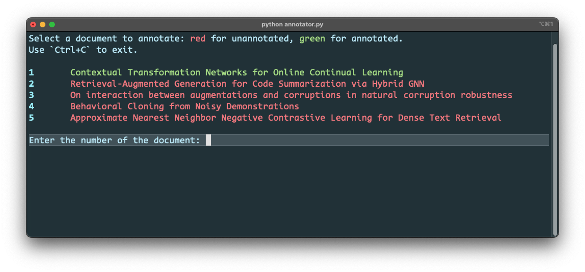
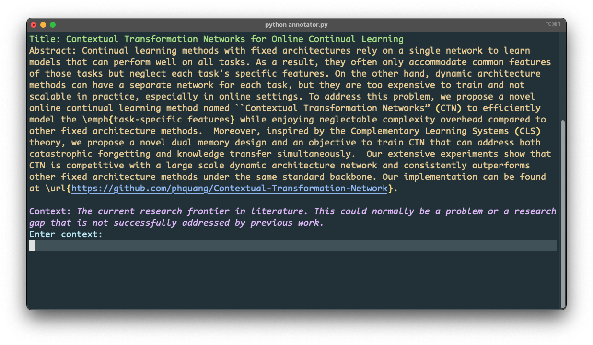

# Command Line Annotation Tool for Multi-Aspect Summarization

Installation of dependencies:

```bash
pip install -r requirements.txt
```

Run the tool:

```bash
python annotator.py
```

Screenshots:




